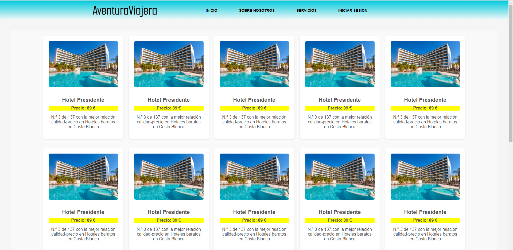

# Proyecto de Página Web en grupo

## Descripción
Lo que se quiere conseguir en este proyecto es la contribución entre varios roles de usuarios modificando el proyecto 2º de DAW del centro IES Luis Braille de Coslada, Madrid.

## Características

 - Intefaz de usuario sencilla para todo tipo de público.
 - Compra de productos.
 - Funcionalidades de busqueda, carrito, perfiles de usuario, roles de administración y usuarios.
 - Diseño adaptable a diferentes dispositivos.

## Imagenes del proyecto

## Servicios necesarios
 Necesitaremos los siguientes servicios:
  - Un servidor de APACHE o de NGINX para poder desplegar la aplicación web.
  - Un editor de texto para poder programar la aplicación web.

## Instalación
  1. Clona este repositorio:  `git clone https://github.com/adrian-9559/pagina-web-fork.git`

  2. Muevete a la carpeta del proyecto a: `cd /var/www/html`

  3. Comprobamos que el servidor está en funcionamiento: `systemctl status apache2`
       Si no esta iniciado, hacemos el siguiente comando: `systemctl start apache2`

Visita http://localhost en tu navegador para ver la aplicación en funcionamiento.

## Contribuciones

Las contribuciones son siempre bienvenidas. Si encuentras algún problema o tienes alguna sugerencia, no dudes en abrir un issue o enviar un pull request.
